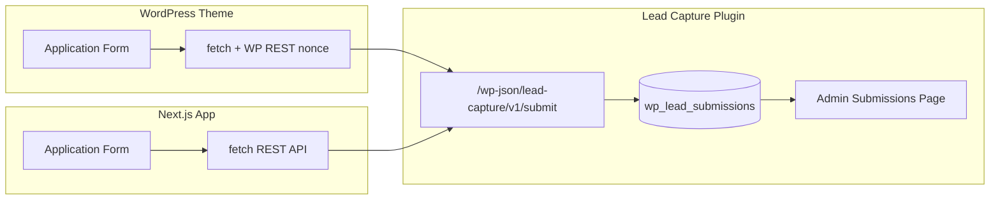

# Lead Capture Form — WordPress & Next.js

A technical assessment implementation: a responsive, accessible lead-capture form built twice (WordPress theme + Next.js), backed by a custom WordPress plugin with REST API storage and an admin submissions viewer.

> **Naming note:** The brief references a `jfrog_submissions` table. Per submission guidelines, this project uses `{prefix}lead_submissions` instead and avoids vendor-specific naming in the repository.

## Repository structure

```
.
├── docker-compose.yml          # WordPress + MySQL
├── wordpress/wp-content/
│   ├── plugins/lead-capture/   # DB table, REST API, admin UI
│   └── themes/lead-capture-theme/
├── nextjs/                     # Next.js frontend
├── scripts/                    # Setup & Lighthouse helpers
└── docs/lighthouse/            # Lighthouse HTML/JSON reports
```

## Prerequisites

- [Docker Desktop](https://www.docker.com/products/docker-desktop/) (or Docker Engine + Compose)
- [Node.js](https://nodejs.org/) 20+ (for Next.js and Lighthouse)
- Git

## Quick start

### 1. WordPress (backend + theme form)

```bash
docker compose up -d
```

Wait ~30 seconds for MySQL and WordPress, then run setup:

**Windows (PowerShell):**

If scripts are blocked, run once: `Set-ExecutionPolicy -ExecutionPolicy RemoteSigned -Scope CurrentUser`

```powershell
.\scripts\wp-setup.ps1
```

**macOS / Linux:**

```bash
chmod +x scripts/wp-setup.sh
./scripts/wp-setup.sh
```

| Resource | URL |
|----------|-----|
| Application form | http://localhost:8080 (page titled **Application**) |
| WP Admin | http://localhost:8080/wp-admin |
| Submissions admin | **Lead Submissions** in the admin menu |
| REST endpoint | `POST http://localhost:8080/wp-json/lead-capture/v1/submit` |

Default admin credentials (local dev only): `admin` / `admin123!`

### 2. Next.js frontend

```bash
cd nextjs
cp .env.example .env.local
npm install
npm run dev
```

Open http://localhost:3000. Submissions are sent to the WordPress REST API (`source: nextjs`).

Ensure WordPress is running before testing Next.js submissions.

### 3. Activate plugin & theme manually (optional)

If you skip the setup script:

1. **Plugins → Lead Capture → Activate**
2. **Appearance → Themes → Lead Capture Theme → Activate**
3. Create a page, assign template **Application Form**, publish.

## Architecture



### WordPress plugin (`lead-capture`)

| Component | Responsibility |
|-----------|----------------|
| `Lead_Capture_Database` | Creates `{wpdb_prefix}lead_submissions`, inserts/queries rows |
| `Lead_Capture_REST_API` | `POST /lead-capture/v1/submit` — validation + persistence; CORS for Next.js dev |
| `Lead_Capture_Admin` | Paginated table of submissions under **Lead Submissions** |

**Table columns:** `id`, `first_name`, `last_name`, `email`, `phone`, `country`, `date_of_birth`, `consent`, `source`, `created_at`

### WordPress theme

- Page template `template-application.php` renders the Figma-aligned layout.
- Client-side validation in `assets/js/form.js`.
- Submits via `fetch` to the REST route with `X-WP-Nonce` (standard WP AJAX/REST pattern).

### Next.js app

- App Router (`app/page.tsx`) + shared CSS design tokens matching the theme.
- `lib/validation.ts` — client validation mirroring server rules.
- `lib/api.ts` — posts JSON to WordPress; configurable via `NEXT_PUBLIC_WP_API_URL`.

### Validation rules (client + server)

| Field | Rule |
|-------|------|
| First / Last name | Required, max 100 chars |
| Email | Required, valid email |
| Phone | Optional; if present, 6–50 allowed chars |
| Country | Optional |
| Date of birth | Optional; `YYYY-MM-DD` when provided |
| Consent | Required |

## Extending the form

### Add a new field end-to-end

1. **Database** — Add column in `class-database.php` (`create_table` + `insert`).
2. **REST API** — Register arg in `get_endpoint_args()`, validate in `validate_payload()`, map in `handle_submit()`.
3. **Admin** — Add column to the list table in `class-admin.php`.
4. **WordPress theme** — Add input in `template-application.php`, validation in `form.js`, payload in submit handler.
5. **Next.js** — Extend `FormFields` in `lib/validation.ts`, UI in `ApplicationForm.tsx`, mapping in `lib/api.ts`.

Run `wp plugin deactivate lead-capture && wp plugin activate lead-capture` (or re-save plugin) to trigger `dbDelta` after schema changes, or bump `lead_capture_db_version`.

### Add allowed Next.js origins (CORS)

```php
add_filter( 'lead_capture_allowed_origins', function ( $origins ) {
    $origins[] = 'https://your-production-domain.com';
    return $origins;
} );
```

Place in a small must-use plugin or child theme `functions.php`.

### Export / webhooks

Hook after successful insert by extending `Lead_Capture_Database::insert` to fire `do_action( 'lead_capture_submitted', $id, $data )` (add the action in the plugin if you fork it).

## Lighthouse reports

With WordPress (port 8080) and Next.js (port 3000) running:

```bash
npm install -g lighthouse
./scripts/lighthouse.sh
```

Reports are written to `docs/lighthouse/` as HTML and JSON for both frontends.

On Windows:

```powershell
.\scripts\lighthouse.ps1
```

See `docs/lighthouse/README.md` for score summaries after generation.

## API reference

**`POST /wp-json/lead-capture/v1/submit`**

```json
{
  "first_name": "Jane",
  "last_name": "Doe",
  "email": "jane@example.com",
  "phone": "+1 555 0100",
  "country": "United States",
  "date_of_birth": "1990-05-15",
  "consent": true,
  "source": "nextjs"
}
```

**Success (201):**

```json
{ "success": true, "id": 1, "message": "Application submitted successfully." }
```

**Validation error (400):**

```json
{ "success": false, "errors": { "email": "A valid email address is required." } }
```

## Design & accessibility

- CSS grid: single column (&lt;768px), two columns on desktop.
- Visible labels (not placeholder-only), `aria-required`, `aria-invalid`, `role="alert"` for errors, `aria-live` status region.
- Focus styles on inputs, links, and submit button.
- `prefers-reduced-motion` respected.

## Development notes

- Docker mounts `wordpress/wp-content` so plugin/theme edits are live.
- Change default passwords before any public deployment.
- Production: put Next.js behind your domain, add origin to CORS filter, use HTTPS, and harden WP admin.

## License

MIT (assessment submission).
